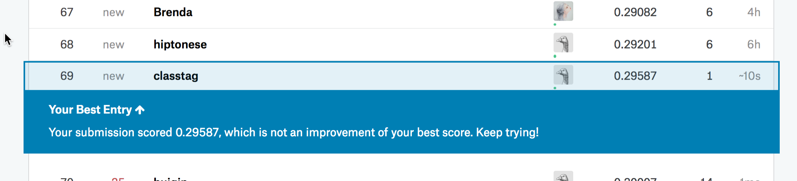

# Dog breed identification with [gluon](https://github.com/gluon-api/gluon-api/)
## Introduction
[Dog Breed Identification](https://www.kaggle.com/c/dog-breed-identification) is a kaggle playground prediction competition for determining the breed of a dog in an image.

Just use the fining-tuning models for features extraction, then build a very sample full-connections layer to classify. It get the the `69th` (top5)



## Model Diagram


## Install

Clone this repository
```git clone git@github.com:classtag/dlnd_dog_breed_identification.git```

Create conda envoriment

Please prepare your annacoda envoriment by Google.

```
conda create -n dlnd_dog_breed_identification python=3
```

Install packages
```
pip install -U --pre mxnet-cu80
pip install -U --pre jupyter
```

Open this repository files with your jupyter.
